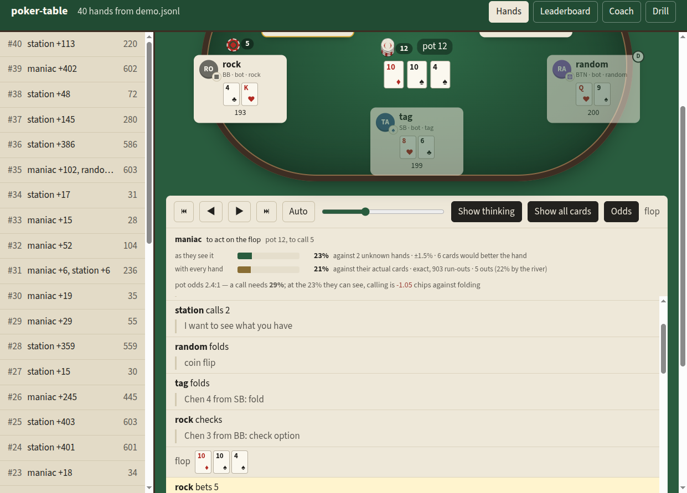

# The probability calculator

Poker is a game of incomplete information, and most of the arithmetic around it is not hard —
it is just tedious, and people get it wrong under pressure. `poker_table.odds` does it, in the
two shapes the question actually comes in.

**Without the other hands.** The ordinary case at the table: your two cards against *n* hands
you cannot see. This is the only version a seat may ask for while a hand is live, because a
`SeatView` has never held anyone else's cards — swap the other seats' cards for aces and the
answer does not move. It is sampled, and it says so, with the standard error printed next to
the number so nobody reads ±1.5% as precision.

**With the other hands.** A replay, a review, or a calculator you are typing into. Every
remaining board is enumerated, so the answer is a fraction rather than an estimate: 98 against
AA on `Ts 7c 2d Kh` is **8/44**, not "about 18%".

```sh
uv run poker-table odds "9h 8d" -b "Ts 7c 2d Kh" --vs "As Ac" --pot 60 --call 20
uv run poker-table odds "Ah Kh" -b "Qh 7h 2c" --vs 2 --pot 40 --call 15
uv run poker-table odds "Ah Ad" --vs "Ks Kd,?"     # one hand known, one not
```

```
9h 8d on the turn (Ts 7c 2d Kh) against As Ac
  Win 18.2% · tie 0.0% · lose 81.8%
  Equity 18.2% (exact, 44 run-outs)
  Outs to the best hand: 8 (6c Jc 6d Jd 6h Jh 6s Js) — 18.2% by the river, 16% by the rule of 2 and 4
  Pot 60, to call 20: pot odds 3.0:1, break-even equity 25.0%
  Calling is -5.5 chips against folding — 6.8% less equity than the price asks
```

## In the replay

The Odds panel follows the step you are on: whose decision it is, what the pot is offering, and
the same two answers as bars — what that seat could work out, and what the replay also knows
because the file has everyone's cards. The second row appears only while **Show all cards** is
on, so replaying your own session does not spoil it.



## The formulas

Written out because the point of a calculator is that its numbers can be checked.

| | |
|---|---|
| **Pot odds** | calling `to_call` into `pot` buys a final pot of `pot + to_call`, so you pay `to_call / (pot + to_call)` of it — which is also the equity a call needs to break even. Spoken the usual way round: `pot : to_call`. |
| **EV of calling** | `equity × (pot + to_call) − to_call`, against 0 for folding. Exact when the call ends the betting; on an earlier street it ignores the next one, which cuts both ways (implied and reverse implied odds). |
| **Outs → probability** | with `k` outs among `n` unseen cards: `k / n` with one card to come; `1 − C(n−k, 2) / C(n, 2)` with two, i.e. one minus the chance of missing twice. |
| **Rule of 2 and 4** | `2k%` per card, `4k%` for two — printed beside the real number, never instead of it. It runs high above about eight outs (nine outs: 36% estimated, 35.0% real). |
| **Ties** | a chopped run-out is worth `1 / (players sharing it)`, so equity is a share of the pot, not a win rate. |

**Outs** are counted two ways, to match the two questions. Against known hands: the cards that
put you ahead — and a hand that is already ahead has none, it has the pot. Blind: the cards that
better your hand *and* beat the board, so a card that only pairs the board is not an out,
because it pairs everybody's. That gives the counts players actually use — two overcards 6, a
flush draw with two overcards 15, an open-ender with two live cards 14.

## Checked against the published tables

| spot | this calculator | published |
|---|---|---|
| AA against 1 random hand | 85.2% ±0.1% (60k samples) | 85.2% |
| AA against 8 random hands | 34.8% ±0.2% (60k samples) | ~34.9% |
| 98 against AA on `Ts 7c 2d Kh` | 8/44 = 18.18% (exact) | 8 outs, 18.2% |
| nine outs, one card to come | 19.1% | 19.1% |
| nine outs, two cards to come | 35.0% | 35.0% |

## What the models see

An LLM seat is prompted with the calculation — equity, outs, pot odds and what calling is
worth — instead of being left to do arithmetic it is bad at. `SeatView.describe(numbers=True)`
is what produces that block, and `SeatView.odds()` is the same thing as data. The terminal
human seat gets it too, since a player would have a calculator open anyway.

The [Laya](laya.md) seat takes `numbers=True` as well, but it is **off by default**: it changes
what the model reads, and the measurements in `docs/laya.md` were taken without it. Turning it
on means running `scripts/measure_laya.py` again before quoting any number.

## What it is not

It is not a solver. It answers "how often does this hand win from here, and what is the price",
which is a question about cards. It says nothing about what *should* be bet, what a range
should look like, or what happens on the next street — for that, see the coach
([docs/baseline.md](baseline.md)), which grades decisions against charts and equity, and is
itself honest about not having a postflop solver behind it.
